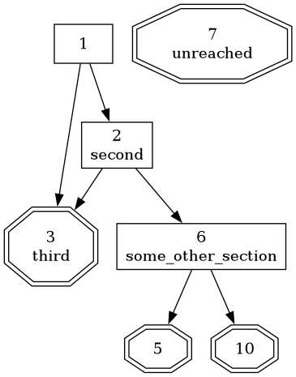

# Pangamebook
[Pandoc](https://pandoc.org) is a free tool that converts documents between a
large number of file formats. **Pangamebook** is a filter that can be used with
Pandoc to shuffle and number sections in the document being converted. The only
known use-case is to create classic [gamebooks](https://en.wikipedia.org/wiki/Gamebook).

Pandoc and Pangamebook should run on most modern computers. It has been tested
on desktop computers running Windows 10, Linux (Lubuntu and Debian) and FreeBSD.
Also on a Raspberry Pi 4 running Raspberry Pi OS and on an Android phone (in
Termux). Tested versions of Pandoc include 2.9.2.1, 3.0, and 3.1.8.

# Installing
To use this filter you need to have Pandoc 2.1 or later installed (see
[https://pandoc.org/installing.html]). Also see the [Pandoc Getting Started
Article](https://pandoc.org/getting-started.html) if you never used Pandoc
before.

The Pangamebook filter itself does not have to be installed. The file
*pangamebook.lua* must be copied to somewhere on your computer and
named on the command-line when running pandoc (see examples below).

## Windows
Install Pandoc. Install MikTex (as linked from the Pandoc download page).
Restart computer. Download *pangamebook.lua* and *example.md*.
That should be enough to be able to run all the
examples below. Otherwise search for help.

## FreeBSD
Install the pandoc, texlive-full, and graphviz packages.

# Input Document
First you need to write your gamebook. The recommended format is [Pandoc's
Markdown](https://pandoc.org/MANUAL.html#pandocs-markdown). That is the format
used for this README file and there is also an *example.md* document in this
repository.

Other formats are also possible, but it can be tricky to make Pandoc and
Pangamebook to properly interpret cross-references in some formats. Also
Pandoc's Markdown supports inserting meta-data and inlining style information
that can be very useful for advanced users, so it can be a good idea to get used
to that format. Most modern text editors support Markdown, so
it should not be difficult to get started.

# What the Filter Does
Pangamebook looks for all top-level headers that consists of only lowercase
letters, digits, and underscores. Headers like *start*, *first_room*, or
*finding_some_loot_23* will be affected, but headers like *Introduction*, *How
To Play*, *character sheet*, or *Epilogue* will be ignored (as they contain
upper-case letters and/or spaces). All ignored sections are expected to be
either at the very beginning or end of the document.

Pangamebook collects each affected (i.e. non-ignored) header together with
everything that follows it up until the next top-level header, including
lower-level headers and all text and images and tables etc. That collection is
considered a *section*.

A top-level header that is a (positive) number will keep that number in
the output document as well. Other than that its section are handled
like all other gamebook-sections. Trying to use the same number twice
causes the filter to print an error message and abort.

Pangamebook versions before 1.6.0 just shuffled randomly. Starting with version
1.6.0 a more predictable method is used that tries to spread out sections
with constant gaps. Sections that are adjacent in the input document will end
up 23 numbers apart in the output document, if possible. The number 23
can be configured by setting metadata **gamebook-gap**. If it is set to something
less than 1 the old method of just randomly shuffling the sections will
be used instead. The old method also handles numbered input-sections
slightly differently. It will not allow sections before such a section
to be shuffled to after it, and vice-versa.

After shuffling all sections that are to be shuffled, all their headings
are numbered in sequence. There may be gaps created where there are
headers that were given a fixed number. Headers that were already numbers,
as mentioned above, will not be affected.

All cross-references in the document will lastly be updated to display
the number they refer to, so what was in the original document
"see first_room" (where *first_room* is a valid cross-reference, not just text)
will become something like "see 12".

The best way to learn is probably to experiment with the included
*example.md* and skim some of Pandoc's documentation.

# Output Document
Most or all of the output formats Pandoc support should be possible (e.g. EPUB,
PDF, HTML). By default Pandoc is going to remove almost all styling from
documents as part of converting them, but see [Pandoc's User
Guide](https://pandoc.org/MANUAL.html) for information on all the ways you can
add style to the output document.

# Configuration
Pandoc Metadata can be used to configure the output of pangamebook. The *-M* (or
*--metadata*) flag is used for pandoc to add metadata variables. Values can also
be set in the input document for file formats that support metadata blocks (e.g.
Pandoc's Markdown). The following variables are supported:

Name                    Type     Default     Description
----------------------  -------  -------     ---------------------------------
gamebook-gap            integer  23          Ideal distance between sections
gamebook-numbers        boolean  true        Replace section names with numbers
gamebook-post-link      string   ''          Text to add after every link
gamebook-pre-link       string   ''          Text to add before every link
gamebook-randomseed     integer  2023        Set random seed for shuffle
gamebook-shuffle        boolean  true        Shuffle sections
gamebook-strong-links   boolean  true        Use strong text style for links

# Gamebook Graph (Graphviz)
The included Pandoc filter *pangamebookgv.lua* can create a plain-text Graphviz file
from a generated gamebook, that can then be used with the *dot* or *twopi*
commands from [Graphviz](https://graphviz.org) to generate an image (e.g PNG) of
how all sections in the book are connected. Both the original header and
assigned number of each section is included in the graph.

# Examples
The file *example.md* is a Pandoc Markdown example gamebook. Open your favorite
terminal and cd to this directory. The following commands can be used to
generate a PDF, EPUB, and HTML book:

    pandoc --lua-filter=pangamebook.lua -o example.html example.md
    pandoc --lua-filter=pangamebook.lua -o example.epub example.md
    pandoc --lua-filter=pangamebook.lua -o example.pdf example.md

(Pandoc needs *pdflatex* to be installed to generate a PDF. It will otherwise
complain loudly when you run that last line. How to install pdflatex is beyond
the scope of this README file.)

If you want to edit the generated book in a word processor it is also possible
to generate for instance a MS Word or LibreOffice Word document:

    pandoc --lua-filter=pangamebook.lua -o example.docx example.md
    pandoc --lua-filter=pangamebook.lua -o example.odt example.md

To output RTF the *--standalone* (or *-s*) flag is needed for pandoc, unless
you know what you are doing and really want only a partial RTF document (that
is not likely, so remember that flag):

    pandoc --lua-filter=pangamebook.lua -s -o example.rtf example.md

Manually editing the document after running Pandoc is probably a bad idea. Any
edits will have to be done again if the document is ever recreated. It is better
to read up on how to apply styles to the generated file, for instance by using a
template style Word document.

This is how to set some metadata variables, in this case to put double square brackets
around links and disable shuffling:

    pandoc -Mgamebook-shuffle=false -Mgamebook-pre-link="[[" -Mgamebook-post-link="]]" --lua-filter=pangamebook.lua -o example.html example.md

To generate a graph from the book first create a new Markdown document
using the pangamebook filter and then use the pangamebookgv filter
on the resulting document, before running the Graphviz dot command.
Pandoc must be told to use plain-text as output format when
creating the DOT file.

    pandoc --lua-filter=pangamebook.lua -o example2.md example.md
    pandoc --lua-filter=pangamebookgv.lua -t plain -o example2.dot example2.md
    dot -Tpng -O example2.dot

The generated graph will be in the file *example2.dot.png*.

# Export Heading Map (Advanced)
Most will never need to use this, but
the mapping of headers to numbers
is added as metadata by the filter, normally not
included in the output.
One way to look at it is to output a JSON file using Pandoc:

    pandoc --lua-filter=pangamebook.lua -o example.json example.md

Look for the key **pangamebook-mapping**. The value is an object with
all headers mapped to numbers (as strings), although with some extra
data that has to be filtered out because of how Pandoc stores metadata.
Here is an example of what a key and value can look like:
    "#second" : {"t" : "MetaString",
        "c" : "2"}
# Development
Bug reports and feature requests are welcome on GitHub. The goal is to keep this
tool simple and focus on only shuffling and numbering the sections. Additions
are most likely better done by creating additional Pandoc filters, leaving it to
end-users to decide what filters to combine.

Pangamebook is version managed using a private
[Fossil](https://fossil-scm.org/) repository. The git repository on GitHub is a
mirror that is updated with new releases.

# LICENSE
MIT License

Copyright (c) 2021-2024 Pelle Nilsson

Permission is hereby granted, free of charge, to any person obtaining a copy
of this software and associated documentation files (the "Software"), to deal
in the Software without restriction, including without limitation the rights
to use, copy, modify, merge, publish, distribute, sublicense, and/or sell
copies of the Software, and to permit persons to whom the Software is
furnished to do so, subject to the following conditions:

The above copyright notice and this permission notice shall be included in all
copies or substantial portions of the Software.

THE SOFTWARE IS PROVIDED "AS IS", WITHOUT WARRANTY OF ANY KIND, EXPRESS OR
IMPLIED, INCLUDING BUT NOT LIMITED TO THE WARRANTIES OF MERCHANTABILITY,
FITNESS FOR A PARTICULAR PURPOSE AND NONINFRINGEMENT. IN NO EVENT SHALL THE
AUTHORS OR COPYRIGHT HOLDERS BE LIABLE FOR ANY CLAIM, DAMAGES OR OTHER
LIABILITY, WHETHER IN AN ACTION OF CONTRACT, TORT OR OTHERWISE, ARISING FROM,
OUT OF OR IN CONNECTION WITH THE SOFTWARE OR THE USE OR OTHER DEALINGS IN THE
SOFTWARE.
